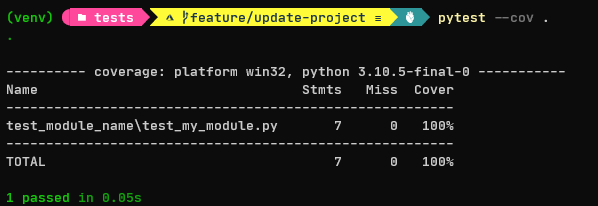
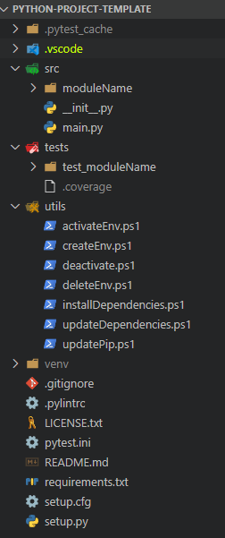

# Python Coding Guidelines

The Python Coding Guidelines are a set of tried-and-true guidelines, rules, and best practices about coding in Python.

## Objective <a name="objective"></a>

The aim of the guidelines is to help developers to use Python effectively and to provide a more readable modern Python style. A code that is easily maintainable and scalable. Also, to establish a development standard to be followed when developing applications or libraries in Python.

I hope that this document can also help you to get started with Python. If you come from another scripting language such as JavaScript, you will find that Python is very similar and this document is a way to transition to Python.

The guidelines are focused on all the resources provided by the Python Language usually defined in PEP8 Standard. [PEP8](https://peps.python.org/pep-0008/#introduction)
PEP8 here is just used as base for this coding guideline proposal. I want to promote a more readable and modern Python style.

You may find that some of the rules of this guideline contrary to your expectations or even contrary to your experience.

<b>If I haven't suggested that you change your coding style in any way, I have failed!</b>

Please try to verify or disprove the rules of this guideline. In particular, I really would like to have some of the proposed rules backed up with measurements ro better examples.

## Why Do We Need Coding Guidelines? <a name="why-codeguidelines"></a>

Is a general rule of software development to craft applications that are readable, maintainable and scalable. This is not always the truth, but we aim for this goal.

Code standards are tools that helps to achieve building applications with the triad principles above mentioned. Here are some of the benefits that are provided by establishing a consistent development standard:

-   Reduction of security risks
-   Increase software performance
-   Increase software quality
-   Reduce system complexity
-   Cost efficient

> :warning: **Warning:** This is a living document under continuous improvement. Comments and suggestions for improvements are most welcome. I plan to modify and extend this document as our understanding improves and the language the set of available libraries evolves.

## Table of Contents

1. [Objective](#objective)
2. [Why Do We Need Coding Guidelines?](#why-codeguidelines)
3. [Proposed Convention](#proposed-convention)
4. [Proposed Python Documentation](#proposed-doc)
5. [Linter](#linter)
6. [Testing Framework](#testing)
7. [Project Default Structure](#project-structure)

## Proposed Convention <a name="proposed-convention"></a>

| Name                      | Convention | Code Example                                        |
| ------------------------- | ---------- | --------------------------------------------------- |
| single variable name      | camelCase  | `age: int = 100`                                    |
| compound variable name    | camelCase  | `firstName: str = "Akira"`                          |
| constant name             | CONST      | `CPU: number = 8`                                   |
| compound constant name    | CONST      | `MAX_NUMBER: number = 100`                          |
| enum name                 | PascalCase | `class Color(Enum): RED = 1 GREEN = 2`              |
| function name             | camelCase  | `def main()`                                        |
| function with parameters  | camelCase  | `def calculate(n1: int, n2: int)`                   |
| function with return type | camelCase  | `def calculate(n1: int, n2: int) -> int:`           |
| compound function name    | camelCase  | `def addTwoNumbers(n1: int, n2: int) -> int:`       |
| class name                | PascalCase | `class Base`                                        |
| compound class name       | PascalCase | `class MyClass`                                     |
| interfaces                | PascalCase | `class IUser(ABC)`                                  |
| casting                   | default    | `age: int = int(100)`                               |
| list                      | camelCase  | `myList: list[int] = [1,2,3]`                       |
| tuple                     | camelCase  | `myTuple: tuple[int] = (1,2,3)`                     |
| set                       | camelCase  | `mySet: set[int] = {1,2,3}`                         |
| dictionary                | camelCase  | `myDictionary: dict = {"name": "John", "age": 100}` |

## Proposed Python Documentation <a name="proposed-doc"></a>

We proposed to use Google Doc Style for Python Documentation as it is the easiest to read and understand. Google Style guide is also very popular and widely used in the Python Community.

```python
def addBinary(a: int, b: int)-> int:
    '''
    Returns the sum of two decimal numbers in binary format.

    Parameters:
        a (int): First number to add
        b (int): Second number to add

    Returns:
        binary (int): Binary int of the sum of a and b
    '''
    binarySum = bin(a+b)[2:]
    return int(binarySum)
```

## Linter <a name="linter"></a>

The idea of using linter for python is to enforce the coding guidelines proposed in this document. I will be using [pylint](https://www.pylint.org/) as linter to be used.

## Testing Framework <a name="testing"></a>

The framework proposed for testing is [pytest](https://docs.pytest.org/en/stable/). It is also a very popular testing framework for Python.

-   To run the tests, you can use the following command:
    Go inside of the `tests` folder:

```bash
pytest
```

[](http://)

-   For code coverage, you can use the following command:
    Go insde of the tests folder:

```bash
pytest --cov .
```

[](http://)

For more pytest commands follow the official documentation here [pytest](https://docs.pytest.org/en/stable/)

### How To Define a Test?

Here is an example of function definition for a test:

After creating your function as depicted in the example below:
[](http://)

You can create your unit test following these steps:

-   Tests contain the prefix or postfix `test_` in the function name.
-   Tests are organized in Arrange, Act, Assert (AAA) pattern.
-   Test documentation is written in the docstring of the test function.

[](http://)

## Project Default Structure <a name="project-structure"></a>

To start a fresh project you can clone the project using the following command:

```bash
git clone https://github.com/rsaz/python-project-template
```

Here is a proposed project default structure.

[](http://)

Project structure is based on the following:

| Folder / File          | Description                                                                                                                                  |
| ---------------------- | -------------------------------------------------------------------------------------------------------------------------------------------- |
| utils                  | PowerShell scripts that allows you to create, activate, deactivate and delete environments, as well as to update and create the dependencies |
| .vscode                | Editor specific configuration                                                                                                                |
| src                    | Project main source folder                                                                                                                   |
| test                   | Folder that contains all application unit tests                                                                                              |
| venv                   | Python virtual environment                                                                                                                   |
| .pylintrc              | Configuration file for pylint static code analyzer for Python                                                                                |
| pytest.ini             | Configuration file for pytest                                                                                                                |
| LICENSE.txt            | Project license terms                                                                                                                        |
| README.md              | Project details                                                                                                                              |
| requirements.txt       | Project dependencies                                                                                                                         |
| setup.cfg and setup.py | Project initial configuration                                                                                                                |
